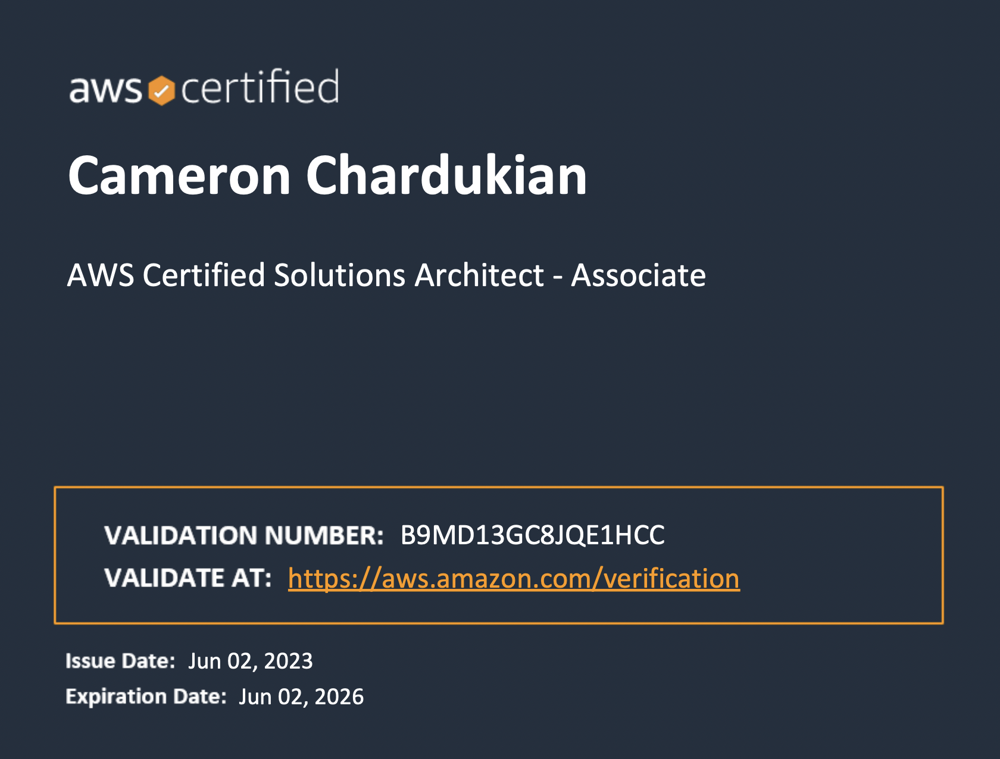

# AWS Certified Solutions Architect - Associate (SAA-C03)

This certificate covers all of the key AWS services as well as the foundational knowledge surrounding those services:

- Identity and Access Management (IAM)
- Simple Storage Service (S3)
- Elastic Compute Cloud (EC2)
- Virtual Private Cloud (VPC)
- Autoscaling and Launch Templates
- Database Solutions including DynamoDB, RDS and Aurora
- Application Services (SNS, SQS, Kinesis, IOT, SES, Step Functions)
- Serverless Architecture (Lambda & API Gateway)
- Monitoring, Deployment and Security

**Languages and Technologies:** AWS

**Date Completed:** June 2nd, 2023

**Validation Number:** B9MD13GC8JQE1HCC

**Note:** You can validate this certificate at: https://aws.amazon.com/verification
