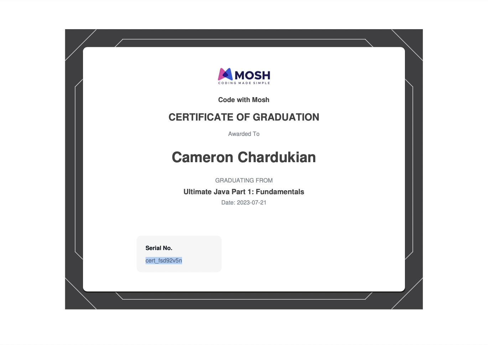

# Ultimate Java Fundamentals

This course covers the core concepts of Java, including variables, data types, arrays, loops, methods, control flow, and object-oriented programming (OOP) principles.

It also includes hands-on projects such as building [mortgage calculators](https://github.com/camchardukian/java-mastery-notes/blob/main/Course_1_Fundamentals/Projects/Monthly_Loan_Balance_Calculator.md).

Feel free to check out [the repository](https://github.com/camchardukian/java-mastery-notes/tree/main/Course_1_Fundamentals) I created while working through this course.

**Languages and Technologies:** Java

**Date Completed:** July 21st, 2023

**Serial Number:** cert_fsd92v5n
