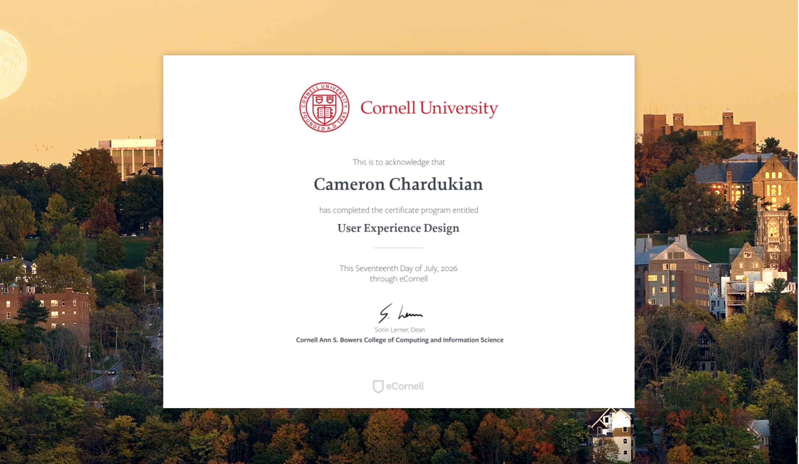

# Cornell University User Experience Design Certificate

This professional certificate represents the successful completion of a six-course program covering the end-to-end user experience design process, from understanding user needs through testing and refining a high-fidelity prototype.

- Contextual user research and interviews
- Activity notes and affinity diagramming
- Persona development
- Ideation and concept generation
- Storyboarding and task flows
- Paper prototyping
- High-fidelity prototyping in Figma
- Usability testing
- Design iteration based on user feedback
- UX case study presentation

As the capstone project for the certificate, I designed **FluentMe**, a mobile app concept helping Vietnamese professionals prepare for, navigate, and reflect on English-language workplace conversations.

**UX Case Study:** https://camchardukian.github.io/fluentme-ux-case-study/

**Skills and Tools:** Human-Centered Design, UX Research, Contextual Interviews, Affinity Mapping, Personas, Storyboarding, Wireframing, Paper Prototyping, High-Fidelity Prototyping, Usability Testing, Figma, FigJam

**Date Completed:** July 17, 2026

**Issued By:** Cornell University, College of Computing and Information Science

**Validation:** https://mycredentials.ecornell.cornell.edu/credential/XrTkGTTses
