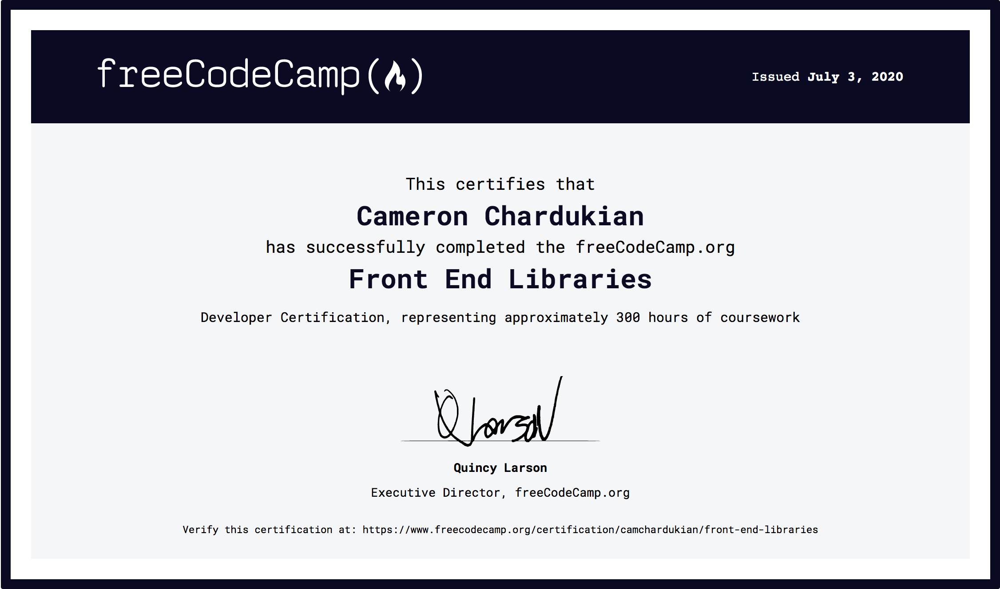

# FreeCodeCamp Front End Libraries Developer Certification

**Background Information:**
FreeCodeCamp is a non-profit organization with an interactive learning platform and online community forum that strives to make learning web development accessible to everyone.

The *FreeCodeCamp Front End Libraries Developer Certification* consists of coursework and five projects. 

Links to my five completed projects as well as the requirements I was prompted with for each project can be [viewed here](https://www.freecodecamp.org/certification/camchardukian/front-end-development-libraries). The average time investment required of students to complete this certification is 300 hours.

**Languages and Technologies:** ReactJS, JavaScript, TypeScript, Redux, SASS

**Date Completed:** July 3rd, 2020

**Certificate Link:** https://www.freecodecamp.org/certification/camchardukian/front-end-development-libraries