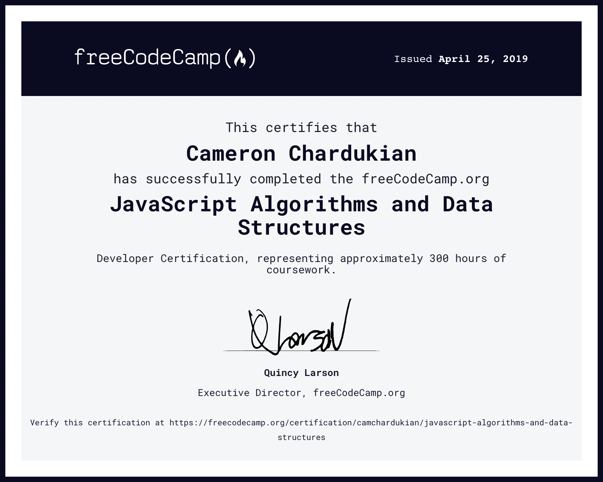

# FreeCodeCamp JavaScript Algorithms and Data Structures Developer Certification

**Background Information:**
FreeCodeCamp is an open-source community that offers developers a structured software development curriculum that focuses on project based learning and critical thinking rather than merely following along with tutorials.

The _FreeCodeCamp JavaScript Algorithms and Data Structures Developer Certification_ consists of coursework and five projects.

Links to my five completed projects as well as the requirements I was prompted with for each project can be [viewed here](https://www.freecodecamp.org/certification/camchardukian/javascript-algorithms-and-data-structures). The average time investment required of students to complete this certification is 300 hours.

**Languages and Technologies:** JavaScript

**Date Completed:** April 25th, 2019

**Certificate Link:** https://www.freecodecamp.org/certification/camchardukian/javascript-algorithms-and-data-structures
