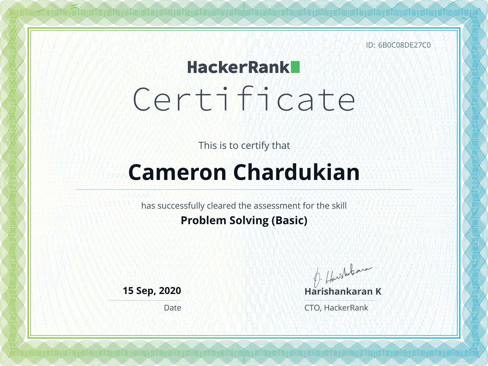

# HackerRank Problem Solving (Basic) Certification

**Background Information:**
HackerRank is an online technical skills assessment platform.

The *HackerRank Problem Solving (Basic) Certification* covers basic forms of Data Structures (such as Arrays and Strings) as well as basic Algorithm types (like Sorting and Searching).

**Languages and Technologies:** JavaScript

**Date Completed:** September 15th, 2020

**Certificate Link:** https://www.hackerrank.com/certificates/6b0c08de27c0