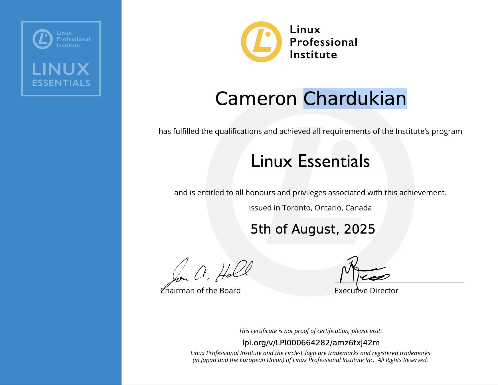

# Linux Essentials

The Linux Professional Institute Linux Essentials certification validates foundational knowledge of Linux, open-source software, command-line use, system administration, security, and permissions.

- Linux and open-source software
- Command-line fundamentals
- Files, directories, and text processing
- Basic scripting and data handling
- Users, groups, ownership, and permissions
- Networking and security fundamentals

**Skills and Technologies:** Linux, Command Line, Shell Scripting, File Permissions, Open-Source Software

**Date Completed:** August 5, 2025

**Issued By:** Linux Professional Institute (LPI)

**Validation:** https://lpi.org/v/LPI000664282/amz6txj42m

