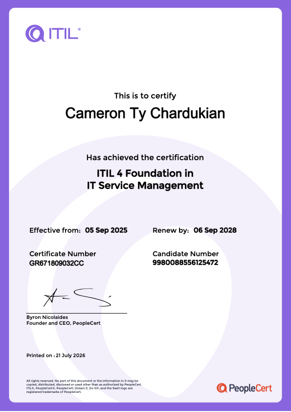

# ITIL 4 Foundation in IT Service Management

The ITIL 4 Foundation certification validates an understanding of the core concepts and practices used to create, deliver, and continually improve technology-enabled services.

- Service management concepts
- The service value system and service value chain
- The four dimensions of service management
- ITIL guiding principles
- Continual improvement
- Key ITIL management practices

**Skills and Technologies:** IT Service Management, ITIL 4, Service Value System, Continual Improvement

**Date Completed:** September 5, 2025

**Issued By:** PeopleCert

**Certificate Number:** GR671809032CC
