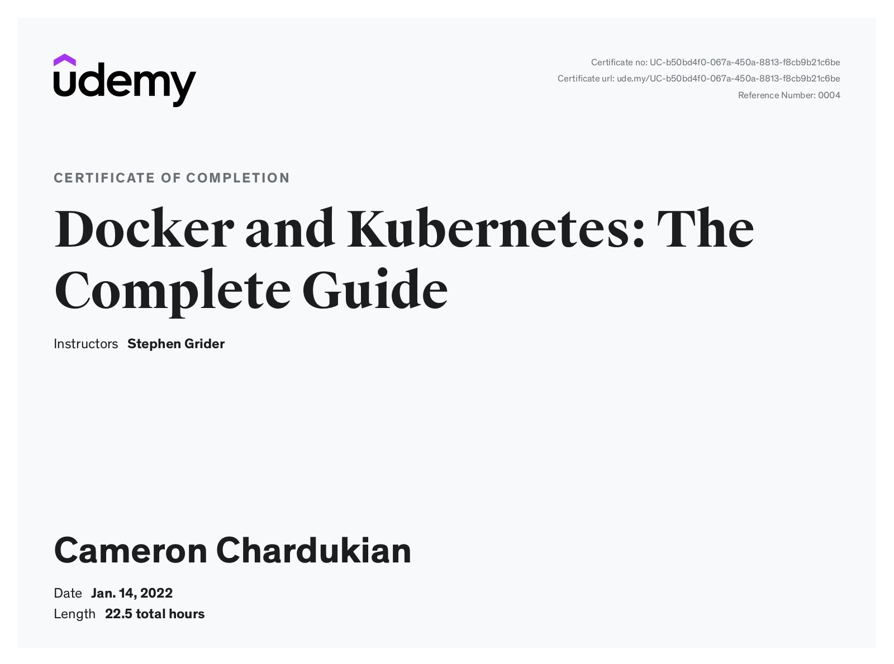

# Docker and Kubernetes: the Complete Guide Certification

**Background Information:**
Udemy is an online course provider that arranges coursework into a series of modules that can include videos, exercises, and assessments.

The _Docker and Kubernetes: the Complete Guide Certification_ covers a number of topics such as:

- Docker containers, images, and services
- Mastering the Docker CLI to inspect and debug running containers
- Continuous integration and deployment with AWS
- The purpose and theory of Kubernetes
- Kubernetes production deployment
- HTTPS setup with Kubernetes

**Languages and Technologies:** Docker, Kubernetes, AWS, Elastic Beanstalk, Google Cloud, GitHub Actions, Redis, Ingress

**Date Completed:** January 14th, 2022

**Certificate Link:** https://www.udemy.com/certificate/UC-b50bd4f0-067a-450a-8813-f8cb9b21c6be/
