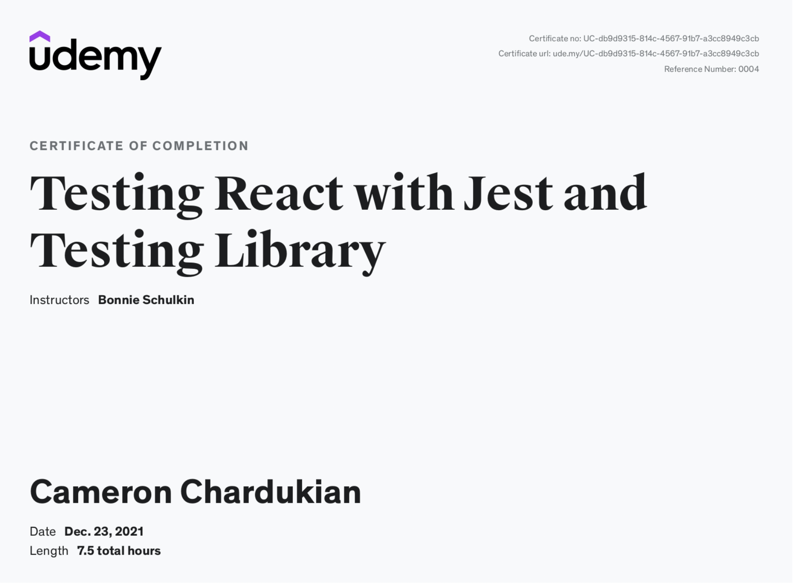

# Udemy Problem Solving (Basic) Certification

**Background Information:**
Udemy is an online course provider that arranges coursework into a series of modules that can include videos, exercises, and assessments.

A few of the topics the *Testing React with Jest and Testing Library Certification* covers include:
* React Testing Library best practices
* How to write tests that interact with your app the same way a user would
* How to write tests that can help you determine whether your code is accessible or not
* Testing asynchronous page changes
* Simulating data from a server using Mock Service Worker

**Languages and Technologies:** ReactJS, Jest, React Testing Library, Mock Service Worker

**Date Completed:** December 23rd, 2021

**Certificate Link:** https://www.udemy.com/certificate/UC-db9d9315-814c-4567-91b7-a3cc8949c3cb/