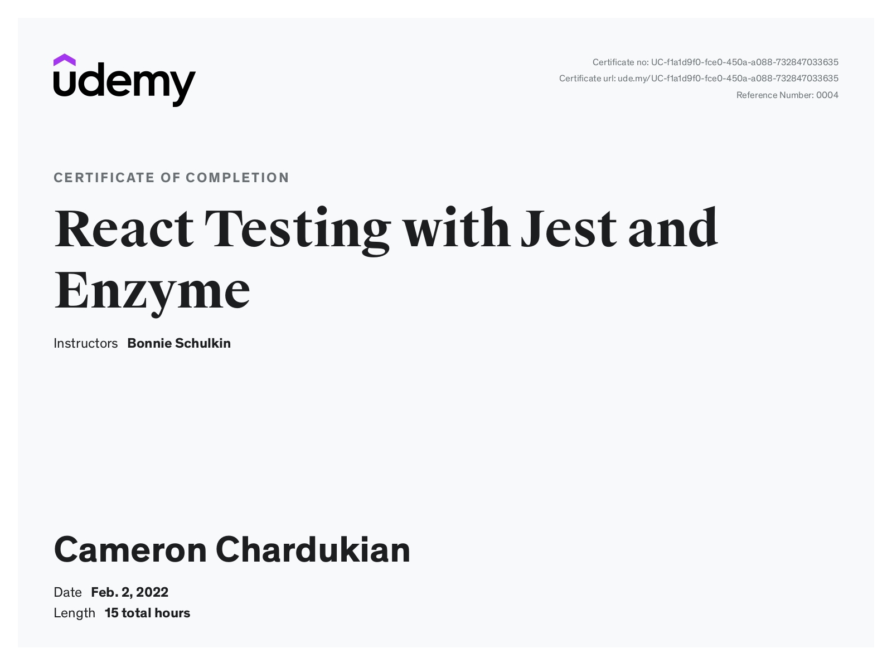

# React Testing with Jest and Enzyme Certification

A few of the topics the _React Testing with Jest and Enzyme Certification_ covers include:

- How to test React components, hooks, and Redux using Jest and Enzyme
- How to write unit tests that lead to easy diagnoses of problems and unexpected behaviors in your application
- Knowing the tradeoffs between different testing approaches and when to choose each style of testing
- Mocking methods and modules to keep your tests isolated

**Languages and Technologies:** ReactJS, Jest, Enzyme

**Date Completed:** February 2nd, 2022

**Certificate Link:** https://www.udemy.com/certificate/UC-f1a1d9f0-fce0-450a-a088-732847033635/
