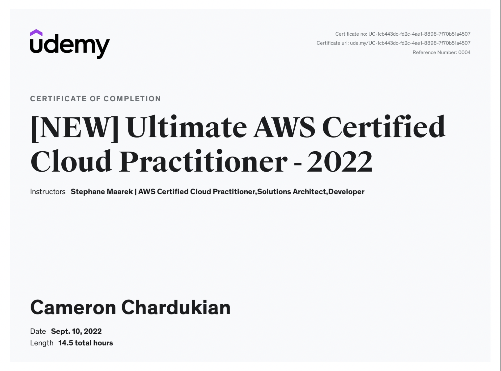

# Ultimate AWS Certified Cloud Practioner Certification

The _Ultimate AWS Certified Cloud Practioner Certification_ is packed with practical knowledge on AWS and how to use a number of the most popular services such as EC2, ELB, ASG, RDS, ElastiCache, and S3.

**Languages and Technologies:** AWS

**Date Completed:** September 10th, 2022

**Certificate Link:** https://www.udemy.com/certificate/UC-1cb443dc-fd2c-4ae1-8898-7f70b51a4507/
