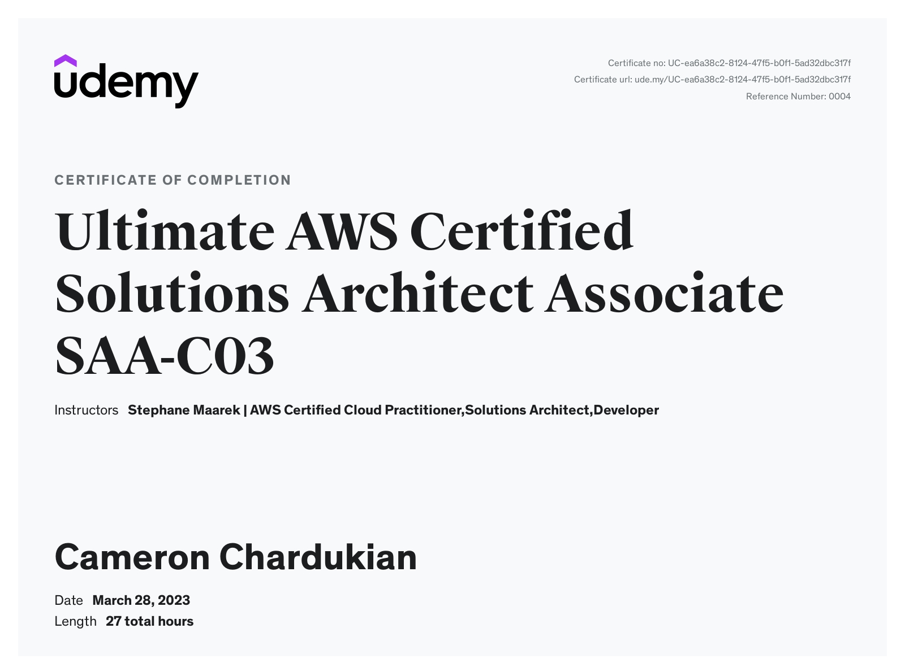

# Ultimate AWS Certified Solutions Architect Certification

The _Ultimate AWS Certified Solutions Architect Certification_ is packed with practical knowledge on AWS and how to use a number of the most popular services such as EC2, ELB, ASG, RDS, ElastiCache, and S3.

It also covers the fundamentals of serverless on AWS including things like Lambda, DynamoDB, Cognito, API Gateway, etc.

Finally, it ensures one can architect solutions on AWS for real-world scenarios.

**Languages and Technologies:** AWS

**Date Completed:** March 28th, 2023

**Certificate Link:** https://www.udemy.com/certificate/UC-ea6a38c2-8124-47f5-b0f1-5ad32dbc317f
