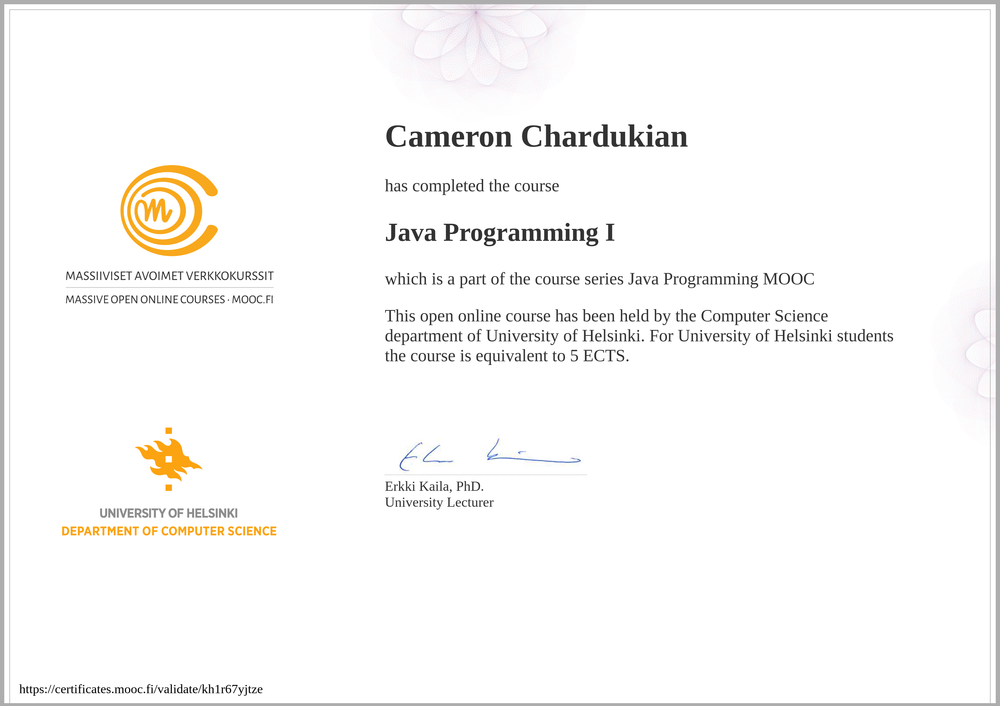

# Java I MOOC - University of Finland

The Java I MOOC from the University of Finland is a rigorous and comprehensive course designed for those committed to mastering Java programming. This course demands a significant time investment, requiring over 10 hours per week of focused study and practice.

Participants engage in hundreds of coding exercises that challenge them to apply their knowledge and solve complex problems. The course covers a wide range of essential topics, including object-oriented programming, data structures, algorithms, and more.

Successfully completing this MOOC not only provides a deep understanding of Java but also equips learners with the practical skills necessary for building scalable, high-performance applications. The intensity and breadth of this course make it a standout credential for any aspiring software developer.

**Languages and Technologies:** Java, Object-Oriented Programming, Data Structures, Algorithms

**Date Completed:** April 3rd, 2024

**Certificate Link:** https://certificates.mooc.fi/validate/kh1r67yjtze
